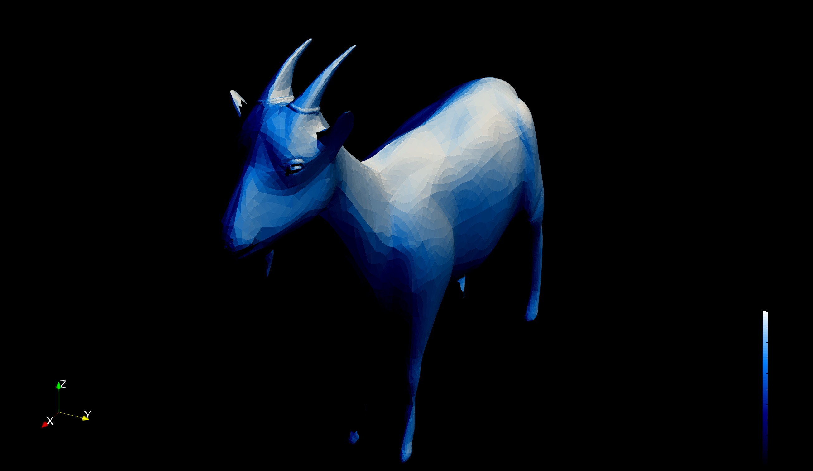

# Cage

Script to compute shade and shadow on an STL file based on ray tracing method


# Code description

`Cage` code computes shade and shadow on an STL file based on ray tracing method


# How to start computation

## Run `Cage`

```console
python3 src/cage.py
```

Tutorial case: `testcase/work*`
The tutorials recommended are `testcase/work_shiroyagi`


# Contact:

Yusuke Takahashi, Hokkaido University

ytakahashi@eng.hokudai.ac.jp


# References

- 
